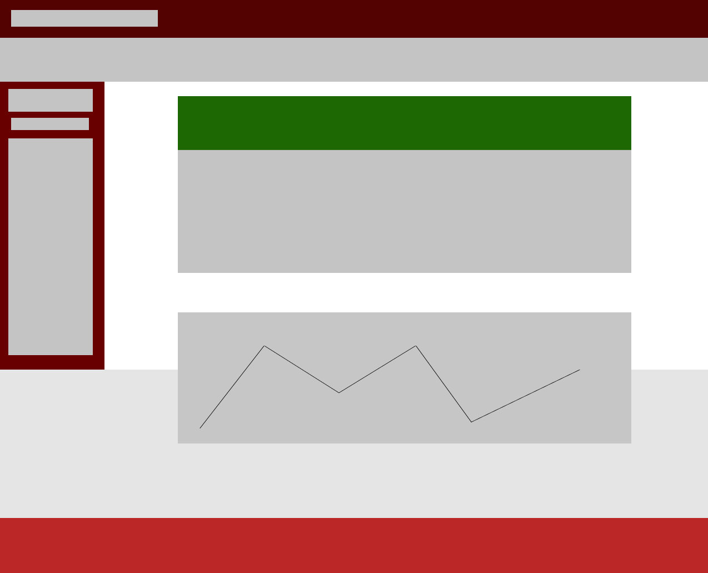

# STKR

STKR is the place to get the latest in financial news and up-to-date stock prices for your top-earning companies while watching trends in the broader US market in one place.

## User Story

As a user, I want to be able to search for my favorite publicly traded companies and see the current selling price of the stock as well as the latest news at the company. I also want to be able to monitor the health of the overall US market.

## Acceptance Criteria

WHEN I search for stocks by symbol
THEN I am presented with the stock price and latest news about that company
WHEN I complete a search
THEN the application saves my search in local storage
WHEN I reload the page
THEN the application remembers my saved companies and displays them

## Deployed Link

Following is a link to the deployed version of STKR
https://naf15.github.io/STKR/

### Wireframes and Screenshots

The following is a preliminary wireframe of the mobile version of the app.

The following is a preliminary wireframe image of the desktop version of the app.

### APIs and CSS Framework

For the successful completion of this project, we used two financial server-side APIs: Financial Modeling Prep and FinnHub. Both APIs provide up-to-date pricing information and news for the main content of the page. CSS styling is backed up by Bulma.

### Breakdown of Features

STKR displays locally stored stock preference information and news in cards on the landing page.

Base code for the stock ticker comes courtesy of:
https://codesandbox.io/s/vthfm?file=/index.html:414-1425
